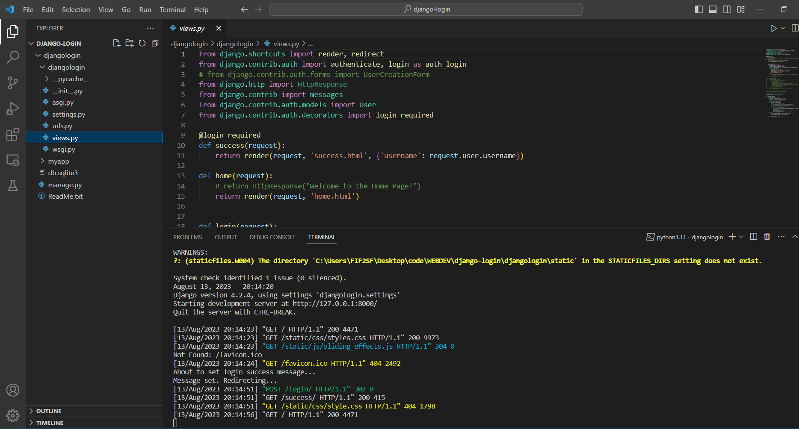
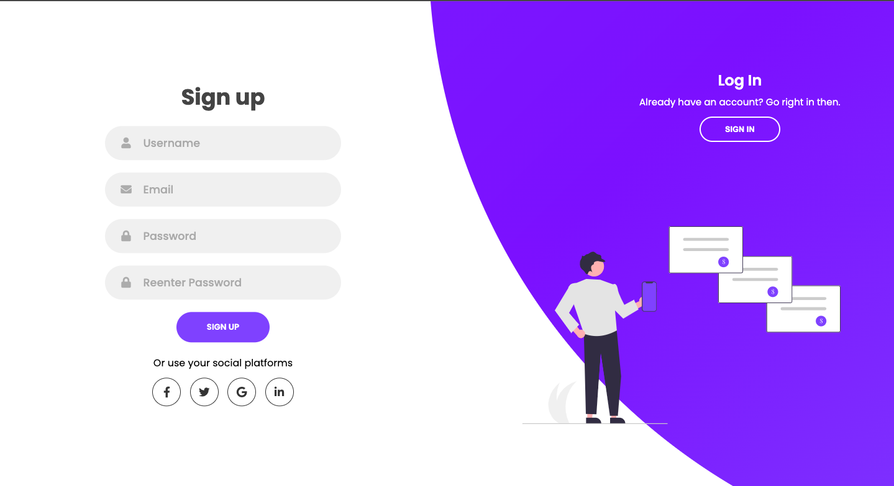
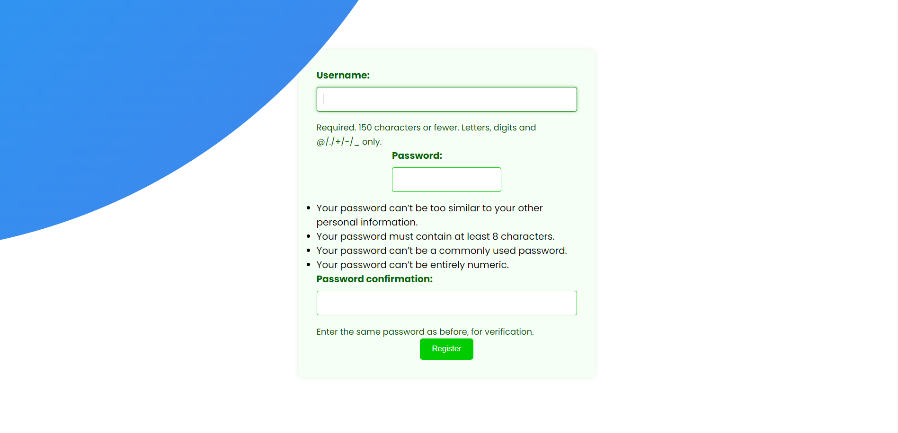
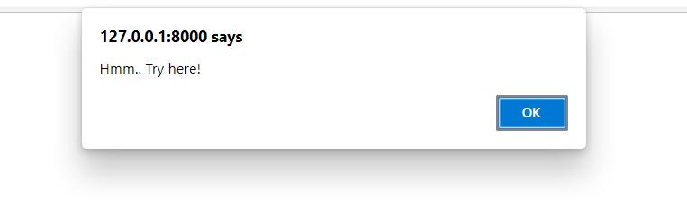
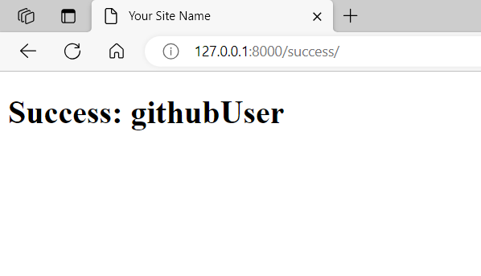

# Django Login Form

This repository contains a Django web application with user authentication capabilities for login and registration forms. Follow the steps below to set up, configure, and deploy this application.

## Table of Contents
- [Setting Up the Django App](#setting-up-the-django-app)
- [Configuring Authentication](#configuring-authentication)
- [Containerize and Deploy to Firebase](#deploying-to-firebase)








## Setting Up the Django App

0. ## Create Django App

 ```
python -m django startproject django
 ```

 - Create static folder with styles
 - Create template folder with htmls
 - Add the paths to urls.py & def functions-requests to views.py

**Migrate the Database Schema**:
This step initializes your database with Django's default tables.
 ```
python manage.py migrate
 ```

**Start the Django Development Server**:
This will start the server on the default port. To specify a different port (e.g., 8080), append it at the end.
 ```
python manage.py runserver
 ```


## Authentication

 **Create an Admin User**:
Django provides a powerful admin interface. To access it, you need an admin user.
 ```
python manage.py createsuperuser
 ```


## Static Files

 **Setting Up Static Files**:
After configuring static files in your Django settings, collect them into the static directory using:
 ```
python manage.py collectstatic
 ```


## Common Issues

 **Django Caching Problem**:
If you encounter issues related to caching, run the server without saving cache using:

 ```
python manage.py runserver --nothreading --noreload
 ```

# Start

1. **Clone the Repository**: 
   ```
   git clone .../FilipFilchev/LoginForm.git
   cd django-login
   ```

2. **Set Up Virtual Environment**:
   ```
   python -m venv venv
   source venv/bin/activate
   ```

3. **Install Required Packages**:
   ```
   pip install -r requirements.txt
   ```

4. **Run Migrations**:
   ```
   python manage.py migrate
   ```

5. **Run the Development Server**:
   ```
   python manage.py runserver
   ```

## Configuring Authentication

1. **Django Settings**: Ensure that `'django.contrib.auth'` and `'myapp'` are added to the `INSTALLED_APPS` in `settings.py`.

2. **URL Configuration**: Make sure the authentication views are included in the `urls.py` of the main project directory.

3. **Templates**: The templates directory contains HTML files for login (`login.html`) and registration (`register.html`). Ensure they're linked correctly with the corresponding views.


Now, hosting a Django app on Firebase requires a few additional steps, since Firebase Hosting is typically used for static websites. However, with the use of Cloud Functions or Cloud Run, we can deploy Django apps.

## Deploying to Firebase

### Containerize Your Django App:
**Docker**
Create a Dockerfile in your Django project root.
Sample Dockerfile:
```
FROM python:3.8-slim

WORKDIR /app
COPY requirements.txt .
RUN pip install --no-cache-dir -r requirements.txt
COPY . .
CMD ["gunicorn", "your_project_name.wsgi:application", "--bind", "0.0.0.0:8000"]
```
Build the Docker image:
``` docker build -t your_image_name .```

Push Your Docker Image to Google Container Registry (GCR):
- Configure gcloud:

Install the Google Cloud SDK.
Authenticate with Google Cloud: gcloud auth login
Set your Google Cloud project: gcloud config set project your_project_id

- Push to GCR:

Tag your image: docker tag your_image_name gcr.io/your_project_id/your_image_name
Push to GCR: docker push gcr.io/your_project_id/your_image_name

- Deploy to Cloud Run:

Deploy:

Deploy your container:
 ```
 gcloud run deploy --image 
 gcr.io/your_project_id/your_image_name --platform managed
 ```

Run: 

### Firebase:

1. **Install Firebase CLI**: 
   ```
   npm install -g firebase-tools
   ```

2. **Login to Firebase**: 
   ```
   firebase login
   ```

3. **Initialize Hosting**: In the project directory, run:
   ```
   firebase init hosting
   ```

4. **Build the Project**:
   ```
   python manage.py collectstatic
   ```

5. **Deploy to Firebase**:
   ```
   firebase deploy --only hosting
   ```

And there you have it! Your Django app should now be hosted on Firebase using Google Cloud Run. Remember, Firebase billing and Google Cloud Platform billing are separate, so keep an eye on your usage to avoid unexpected charges.
